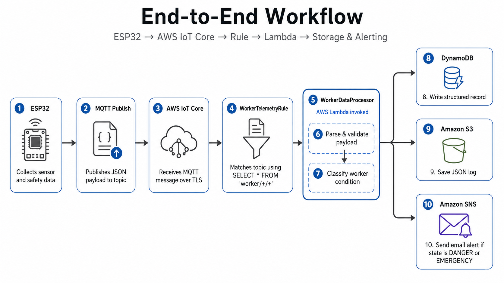

# SOLDIERSAFETY AWS IoT Core and Cloud Configuration Documentation

## 1. Purpose

This document describes the AWS IoT Core and cloud-side configuration used in the **SOLDIERSAFETY Soldier Health and Safety Monitoring System**.

It covers the following configuration components:

- MQTT topic structure
- AWS IoT Rule SQL
- Lambda environment variables
- DynamoDB table reference
- Amazon S3 bucket reference
- Amazon SNS topic reference
- IAM permissions required by the Lambda function
- Security and submission notes

The purpose of this document is to provide a clean and traceable explanation of how soldier data flows from the ESP32 edge device to the AWS cloud backend.

---

## 2. Cloud Workflow Summary

The SOLDIERSAFETY cloud workflow follows this structure:

```text
ESP32 Edge Device
    ↓ MQTT over TLS
AWS IoT Core
    ↓ IoT Rule SQL
AWS Lambda: SoldierDataProcessor
    ↓
DynamoDB / Amazon S3 / Amazon SNS
```

The ESP32 edge device publishes soldier health and safety data to AWS IoT Core using MQTT over TLS. AWS IoT Core then uses an IoT Rule to forward matching MQTT messages to a Lambda function. The Lambda function processes the payload and performs cloud-side actions such as data storage and supervisor notification.

---

## 3. MQTT Topic Structure

The ESP32 edge device publishes data to soldier-specific MQTT topics.

For soldier `W001`, the system uses the following topics:

```text
soldier/W001/telemetry
soldier/W001/hrv
soldier/W001/alert
```

The topic structure follows this pattern:

```text
soldier/{soldier_id}/{message_type}
```

Where:

| Segment | Description | Example |
|---|---|---|
| `soldier` | Root topic namespace for soldier-related messages | `soldier` |
| `{soldier_id}` | Unique soldier or device identifier | `W001` |
| `{message_type}` | Type of data being published | `telemetry`, `hrv`, `alert` |

This structure allows the system to separate regular telemetry, HRV summaries, and alert events while still keeping all data grouped under a common soldier namespace.

---

## 4. Telemetry Topic

### 4.1 Topic

```text
soldier/W001/telemetry
```

### 4.2 Purpose

The telemetry topic is used for periodic soldier health and safety monitoring data.

The ESP32 publishes general monitoring data such as:

- Soldier ID
- Heart rate
- SpO2
- Air-quality index
- Acceleration magnitude
- HRV-related values, if available
- Alarm status
- Alarm level
- Fall-detection status

### 4.3 Typical Payload

```json
{
  "soldier_id": "W001",
  "heart_rate": 82,
  "spo2": 97,
  "aqi": 50,
  "svm": 9.8,
  "sdnn": -1,
  "rmssd": -1,
  "ibi_count": 20,
  "alarm_active": false,
  "alarm_level": 0,
  "fall_detected": false
}
```

### 4.4 Expected Cloud Handling

Telemetry messages should be processed by the Lambda function and stored for monitoring, traceability, and historical analysis.

If the telemetry values indicate a dangerous or emergency condition, Lambda may also classify the event and trigger an SNS notification.

---

## 5. HRV Summary Topic

### 5.1 Topic

```text
soldier/W001/hrv
```

### 5.2 Purpose

The HRV topic is used for fatigue-related data.

It may include:

- SDNN
- RMSSD
- IBI sample count
- Fatigue-risk state
- Soldier ID
- Timestamp, if included by the device

### 5.3 Expected Cloud Handling

HRV messages are forwarded to Lambda for fatigue-risk processing and storage.

The Lambda function can classify the soldier condition based on HRV indicators. For example, very low RMSSD combined with high heart rate may indicate exhaustion risk.

---

## 6. Alert Event Topic

### 6.1 Topic

```text
soldier/W001/alert
```

### 6.2 Purpose

The alert topic is used when the edge device detects a warning, danger, or emergency event.

Examples include:

- Confirmed fall detection
- Critical SpO2 drop
- Abnormal heart rate
- Fatigue risk
- Exhaustion risk
- Unsafe environmental condition

### 6.3 Expected Cloud Handling

Alert messages should be processed with high priority.

When Lambda receives an alert event, it should:

1. Parse the alert payload.
2. Classify the event severity.
3. Store the event in DynamoDB and/or S3.
4. Send an SNS notification if the condition is classified as `DANGER` or `EMERGENCY`.

---

## 7. MQTT Test Client Subscription

For testing in the AWS IoT MQTT test client, the following subscription filter can be used:

```text
soldier/#
```

This subscription captures all MQTT messages under the `soldier` namespace.

It can be used to monitor:

```text
soldier/W001/telemetry
soldier/W001/hrv
soldier/W001/alert
```

This is useful during system validation because it allows all soldier-related messages to be observed from one subscription.

---

## 8. AWS IoT Rule SQL

### 8.1 Rule Name

```text
SoldierTelemetryRule
```

### 8.2 SQL Statement

```sql
SELECT * FROM 'soldier/+/+'
```

### 8.3 Purpose

This AWS IoT Rule captures all soldier-related MQTT messages published by the ESP32 edge device.

The rule matches the following topics:

```text
soldier/W001/telemetry
soldier/W001/hrv
soldier/W001/alert
```

The SQL topic filter uses two `+` wildcards:

```text
soldier/+/+
```

This means:

| Topic Level | Meaning |
|---|---|
| `soldier` | Fixed namespace |
| `+` | Matches any soldier ID |
| `+` | Matches any message type |

Therefore, the rule can process multiple soldiers and message types using the same IoT Rule.

### 8.4 Rule Action

The IoT Rule forwards matched MQTT messages to the Lambda function:

```text
SoldierDataProcessor
```

### 8.5 Responsibility Boundary

The IoT Rule only forwards MQTT payloads to Lambda.

The following operations are handled inside the Lambda function:

- Payload validation
- Soldier-condition classification
- DynamoDB storage
- S3 historical logging
- SNS email notification

This separation keeps the IoT Rule simple and places application logic inside Lambda.

---

## 9. Lambda Function

### 9.1 Function Name

```text
SoldierDataProcessor
```

### 9.2 Role in the Architecture

The Lambda function acts as the cloud-side processing unit.

It is responsible for:

- Receiving MQTT messages from AWS IoT Core
- Parsing soldier telemetry, HRV, or alert payloads
- Classifying the soldier state
- Assigning a danger level
- Saving processed data to DynamoDB
- Saving historical logs to Amazon S3
- Sending SNS notifications for dangerous or emergency conditions

### 9.3 Expected Classification Levels

| Danger Level | State | Meaning |
|---:|---|---|
| 0 | NORMAL | Soldier condition is within safe limits |
| 1 | WARNING | Early abnormal condition detected |
| 2 | DANGER | Serious risk detected |
| 3 | EMERGENCY | Critical condition requiring urgent response |

---

## 10. Lambda Environment Variables

The Lambda function uses environment variables to avoid hard-coding cloud resource names inside the source code.

### 10.1 Environment Variable Summary

| Variable Name | Example Value | Purpose |
|---|---|---|
| `DDB_TABLE_NAME` | `SoldierHealthData` | Defines the DynamoDB table used for processed records |
| `S3_BUCKET_NAME` | `soldier-historical-data` | Defines the S3 bucket used for historical JSON logs |
| `SNS_TOPIC_ARN` | `arn:aws:sns:ap-southeast-1:<ACCOUNT_ID>:SoldierAlerts` | Defines the SNS topic used for email alerts |

### 10.2 Configuration Values

```text
DDB_TABLE_NAME = SoldierHealthData
S3_BUCKET_NAME = soldier-historical-data
SNS_TOPIC_ARN = arn:aws:sns:ap-southeast-1:<ACCOUNT_ID>:SoldierAlerts
```

### 10.3 Variable Explanation

#### `DDB_TABLE_NAME`

This variable defines the DynamoDB table used to store processed soldier telemetry and alert records.

```text
SoldierHealthData
```

#### `S3_BUCKET_NAME`

This variable defines the S3 bucket used to store historical JSON logs.

```text
soldier-historical-data
```

The S3 bucket is useful for:

- Historical review
- Debugging
- Long-term monitoring
- Offline analysis
- Audit records

#### `SNS_TOPIC_ARN`

This variable defines the SNS topic used to send email notifications.

```text
arn:aws:sns:ap-southeast-1:<ACCOUNT_ID>:SoldierAlerts
```

The SNS topic is used when the soldier condition is classified as:

```text
DANGER
EMERGENCY
```

---

## 11. DynamoDB Table Configuration

### 11.1 Table Name

```text
SoldierHealthData
```

### 11.2 Table Schema

| Key Type | Attribute Name |
|---|---|
| Partition key | `DeviceID` |
| Sort key | `Timestamp` |

### 11.3 Purpose

The DynamoDB table stores structured soldier health and safety records.

It may contain:

- Latest soldier telemetry
- Soldier state
- Danger level
- Alarm level
- Fall status
- HRV indicators
- Alert events
- Processing timestamp

The combination of `DeviceID` and `Timestamp` allows the system to store multiple time-ordered records for each soldier or device.

---

## 12. Amazon S3 Historical Logging

### 12.1 Bucket Name

```text
soldier-historical-data
```

### 12.2 Purpose

Amazon S3 is used for storing historical JSON logs.

This is useful because S3 provides a simple location for retaining raw or processed records over time.

Typical S3 log data may include:

- Full telemetry payloads
- HRV summaries
- Alert events
- Lambda processing results
- Debug records
- Historical soldier-condition records

### 12.3 Expected Behavior

The Lambda function should save each processed event to S3.

This is represented in test outputs by:

```json
{
  "s3_saved": true
}
```

---

## 13. Amazon SNS Notification

### 13.1 SNS Topic

```text
arn:aws:sns:ap-southeast-1:<ACCOUNT_ID>:SoldierAlerts
```

### 13.2 Purpose

Amazon SNS is used to notify supervisors when the soldier condition requires attention.

SNS email notification should be sent for:

- `DANGER`
- `EMERGENCY`

SNS email notification should not be sent for:

- Normal telemetry
- Non-critical records

### 13.3 Notification Policy

| Soldier State | Email Notification |
|---|---|
| NORMAL | No |
| WARNING | Optional, depending on deployment policy |
| DANGER | Yes |
| EMERGENCY | Yes |

---

## 14. IAM Policy for Lambda

The Lambda function requires permission to write to DynamoDB, write to S3, and publish to SNS.

The submitted IAM policy follows a least-privilege structure because it grants only the actions needed by the Lambda function.

### 14.1 IAM Policy

```json
{
  "Version": "2012-10-17",
  "Statement": [
    {
      "Sid": "AllowWriteToDynamoDBTable",
      "Effect": "Allow",
      "Action": [
        "dynamodb:PutItem"
      ],
      "Resource": "arn:aws:dynamodb:ap-southeast-1:<ACCOUNT_ID>:table/SoldierHealthData"
    },
    {
      "Sid": "AllowWriteToS3Bucket",
      "Effect": "Allow",
      "Action": [
        "s3:PutObject"
      ],
      "Resource": "arn:aws:s3:::soldier-historical-data/*"
    },
    {
      "Sid": "AllowPublishToSNSTopic",
      "Effect": "Allow",
      "Action": [
        "sns:Publish"
      ],
      "Resource": "arn:aws:sns:ap-southeast-1:<ACCOUNT_ID>:SoldierAlerts"
    }
  ]
}
```

### 14.2 Permission Explanation

| Permission | Purpose |
|---|---|
| `dynamodb:PutItem` | Allows Lambda to store processed records in the DynamoDB table |
| `s3:PutObject` | Allows Lambda to save historical JSON logs to the S3 bucket |
| `sns:Publish` | Allows Lambda to send alert notifications through SNS |

### 14.3 Resource Scope

The policy restricts access to specific resources:

- One DynamoDB table
- One S3 bucket path
- One SNS topic

This is safer than granting broad permissions such as:

```text
dynamodb:*
s3:*
sns:*
```

---

## End-to-End Workflow

The following diagram summarizes the complete cloud-side workflow from edge data acquisition to storage and alerting.



```text
1. The ESP32 collects sensor and safety data.
2. The ESP32 publishes a JSON payload to an MQTT topic.
3. AWS IoT Core receives the MQTT message over TLS.
4. SoldierTelemetryRule matches the topic using SELECT * FROM 'soldier/+/+'.
5. AWS IoT Core invokes SoldierDataProcessor.
6. Lambda parses and validates the payload.
7. Lambda classifies the soldier condition.
8. Lambda writes the structured record to DynamoDB.
9. Lambda saves the JSON log to Amazon S3.
10. Lambda publishes an SNS email alert if the state is DANGER or EMERGENCY.
```


---

## 16. Validation Checklist

The AWS IoT and cloud configuration is valid if the following checks pass:

- ESP32 can connect to AWS IoT Core using MQTT over TLS.
- ESP32 can publish to `soldier/W001/telemetry`.
- ESP32 can publish to `soldier/W001/hrv`.
- ESP32 can publish to `soldier/W001/alert`.
- AWS IoT MQTT test client can receive messages using `soldier/#`.
- `SoldierTelemetryRule` matches messages using `SELECT * FROM 'soldier/+/+'`.
- The IoT Rule invokes `SoldierDataProcessor`.
- Lambda can read the required environment variables.
- Lambda can write records to `SoldierHealthData`.
- Lambda can write JSON logs to `soldier-historical-data`.
- Lambda can publish alerts to `SoldierAlerts`.
- SNS email is sent for `DANGER` and `EMERGENCY` events.
- SNS email is not sent for normal telemetry.

---

## 17. Security Notes

Sensitive values are replaced with placeholders for submission.

The following values should not be exposed in a public repository:

- AWS account ID
- AWS IoT endpoint
- Device certificate
- Device private key
- Root CA certificate
- Wi-Fi SSID
- Wi-Fi password
- SNS topic ARN with real account ID
- Supervisor email address or phone number

In the submitted version, the AWS account ID is represented as:

```text
<ACCOUNT_ID>
```

This protects account-specific information while still showing the correct configuration structure.

---

## 18. Submission Notes

For academic or project submission, this configuration demonstrates that the cloud backend is organized into clear and separated responsibilities.

| Component | Responsibility |
|---|---|
| MQTT topics | Separate telemetry, HRV, and alert messages |
| IoT Rule SQL | Capture soldier-related messages |
| Lambda environment variables | Provide resource configuration |
| DynamoDB | Store structured soldier records |
| S3 | Store historical JSON logs |
| SNS | Notify supervisors |
| IAM policy | Grant minimum required permissions |

This structure supports maintainability, traceability, and clearer explanation of the overall SOLDIERSAFETY system.

---

## 19. Conclusion

The AWS IoT Core and cloud configuration supports the hybrid edge-cloud design of the SOLDIERSAFETY system.

The ESP32 edge device publishes soldier health and safety data to structured MQTT topics. AWS IoT Core captures the messages using a simple IoT Rule and forwards them to the Lambda function. Lambda then performs classification, storage, historical logging, and notification.

This configuration allows the system to monitor soldier conditions in real time while also preserving data for later review and analysis.
